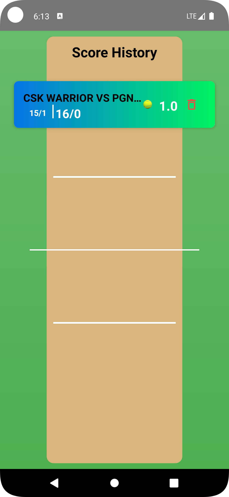

# CricketScoreAPP
Cricket Score App is a simple yet powerful scorekeeping application designed for cricket enthusiasts. It allows users to manually record match scores, track player performance, and maintain a history of past matches. This app is ideal for local cricket tournaments, friendly matches, and practice sessions.

## Screenshots

| Screenshot 1 | Screenshot 2 | Screenshot 3 |
|-------------|-------------|-------------|
|  |  |  |
|  |  |  |
|  |  |  |
|  |  |  |
|  |  |  |

